# 简介

该项目是一个nextjs的入门demo，简单实践了next的路由、样式、状态管理、API处理等主要方面，最后进行了一个Todo项目的实践。

项目地址：https://github.com/PassingTraveller111/nextDemo

# 一、React与Next.js对比

## React以及Nextjs的用途

- React 是一个**用于构建用户界面**的 JavaScript 库。它专注于组件化开发，通过创建可复用的组件来构建复杂的 UI。适用于单页应用（SPA）的开发，例如一些小型的内部工具、仪表盘或者具有高度交互性的网页组件。比如，一个简单的待办事项列表应用，利用 React 可以很好地实现列表的添加、删除、排序等功能，并且可以方便地将这些功能封装在不同的组件中。
- Next.js 是一个基于 React 的框架，主要**用于构建服务器端渲染（SSR）和静态网站生成（SSG）的应用**。它适合开发需要良好的搜索引擎优化（SEO）的网站，如博客、电商网站、新闻网站等。例如，一个新闻网站使用 Next.js 可以在服务器端渲染页面内容，这样搜索引擎爬虫可以更容易地获取页面的完整信息，提高网站在搜索结果中的排名。

## Nextjs有什么优势？

### 1.**服务器端渲染（SSR）和静态网站生成（SSG）**

- Next.js 支持 SSR 和 SSG，这是它的核心优势之一。通过 SSR，页面在服务器端就被渲染成完整的 HTML 格式，然后发送给客户端。这样，浏览器在接收到 HTML 后可以立即渲染出页面内容，减少了白屏时间。例如，对于一个内容型网站（如新闻网站或博客），用户能够更快地看到文章标题、摘要等内容，提升了用户体验。

- SSG 则是在构建时预先生成页面，访问这些页面时直接从服务器获取已经生成好的 HTML，这种方式非常适合内容相对固定的网站。比如，一个产品手册网站，其页面内容不经常变化，采用 SSG 可以极大地提高网站的加载速度，因为不需要在每次访问时动态生成页面。

### 2.SEO

react是spa应用，spa比较大的一个缺点就是难以实现SEO（SEO就是搜索引擎要通过爬虫爬取网页的html获得数据进行排名分类），而spa应用是获取到js脚本以后再进行渲染。

而next.js是直接将html页面发送给客户端，所以爬虫时可以直接读取到有效页面，从而提高搜索引擎排名。

# 二、Next的安装

## 初始化npm

新建一个名为demo的文件夹，在此文件夹下初始化npm环境。

打开终端，输入命令：

```shell
npm init
```

工程目录下就会出现名为`package.json`的配置文件。

## 安装命令

打开终端，输入命令：

```shell
npm install --save next react react-dom
```

## 添加脚本

在`package.json`文件下添加脚本命令：

```json
{
  "scripts": {
    "dev": "next",
    "build": "next build",
    "start": "next start"
  }
}
```

## 创建入口文件

在目录下创建`./pages/index.js`，根据next的路由设计，该文件会被视为入口文件。

在`index.js`编写页面代码：

```jsx
export default () => <div>Welcome to next.js!</div>
```

## 启动项目

本地开发启动命令

```shell
npm run dev
```

默认端口为3000，如果想要指定端口

```
npm run dev -- -p {指定端口号}
```

比如我指定在端口3001启动项目

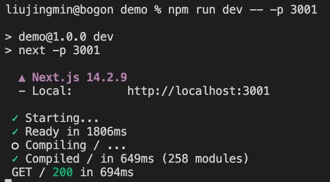

## 访问页面

浏览器访问`http://localhost:3001`

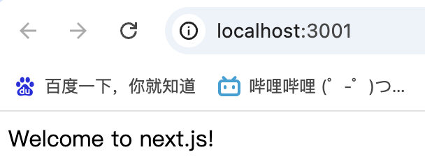


# 三、Next的路由处理

## Next.js是如何实现路由的？

### 1.文件系统路由

Next.js采用文件系统路由，`pages`目录下的每个React组件文件都代表一个路由。

例如：

- `pages/index.js` -> `/`
- `pages/a.js` -> `/a`
- `pages/b/index.js`->`/b`
- `pages/b/c.js`->`/b/c`

文件路由的处理方式比较直观和文件结构相挂钩，这样处理开发者可以通过文件结构了解路由结构，提高代码的可维护性和易读性。

一些组件我们并不期望被访问到，需要做好做好权限处理。

当我们需要频繁修改路由时，就要求我们频繁修改文件结构，这点可能并不友好。

### 2.动态路由

Next.js 支持通过文件名 `[param].js` 创建动态路由。例如，要创建一个可以匹配任何 ID 的动态页面，你可以创建 `pages/[id].js`

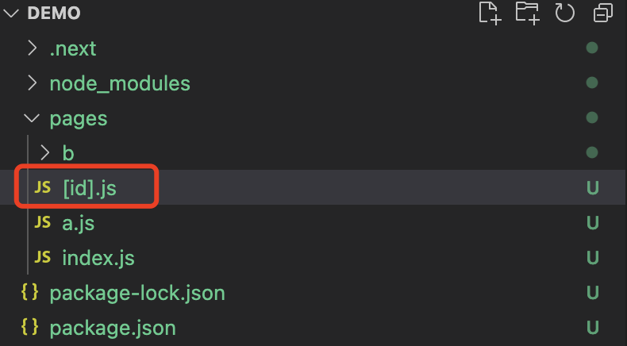

```jsx
import React from 'react';  
import { useRouter } from 'next/router';  
  
export default function Post() {  
  const router = useRouter();  
  const { id } = router.query;  
  
  return <div>Post ID: {id}</div>;  
}
```

访问`http://localhost:3001/any-id`

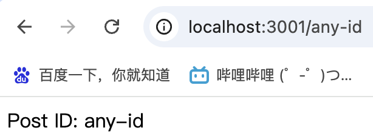

但是如果我们访问`pages/a`，还是会访问a.js，而非得到Post ID：a。由此可以得出结论，文件系统路由的优先级在动态路由之上。

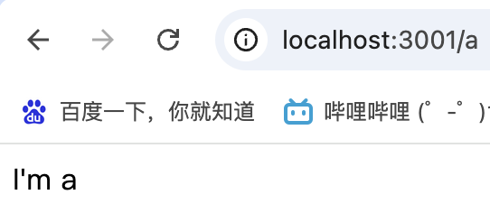

## Next如何进行路由导航？

### 1.使用`next/link`组件

`next/link` 组件允许你在 Next.js 应用中进行客户端路由导航，而不需要刷新页面，下面我们创建一个`Nav`组件，并且在index中引用它。

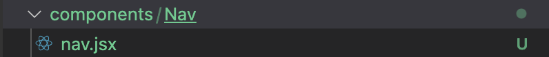

```jsx
import React from 'react';  
import Link from 'next/link';  
  
export default () => {  
  return (  
    <div>  
      <Link href="/">  
        Home
      </Link>
      <br/>  
      <Link href="/a">  
        a
      </Link>  
      <br/>
      <Link href="/b/c">  
        b/c
      </Link>  
    </div>  
  );  
}
```

```jsx
import React from 'react';
import Nav from '../components/Nav/nav.jsx';

export default () => {
    return <>
        <Nav />
    </>
}
```

点击即可实现跳转

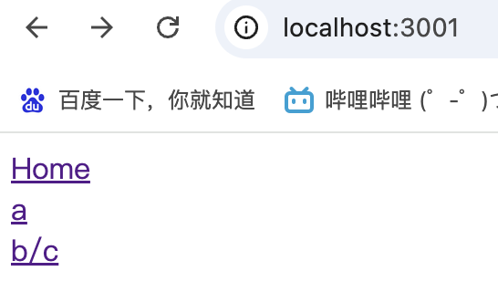

### 2.使用`useRouter `Hook

`useRouter` Hook 可以在任何组件中访问路由相关的对象和方法，例如查询参数、路径名，以及进行编程式导航：

```jsx
import { useRouter } from 'next/router';
import React from 'react';  

export default () => {  
  const router = useRouter();
  const goTo = (path) => {
    router.push(`/${path}`);
  }
  return <>
      <span onClick={() => { goTo('a') }}>a</span>
      <br/>
      <span onClick={() => { goTo('b/c') }}>b/c</span>
      <br/>
      <span onClick={() => { goTo('b') }}>b</span>
  </>
}
```


## Next如何使用路由守卫？

前面展示的路由访问例子，只要是文件系统下的组件，都可以直接通过路径访问到。但是有些时候我们希望拦截住一些路由进行重定向，或者放过一些路由。

比如，未登陆的用户，在访问index时，我们希望将之拦截，重定向到login界面。

这里我们建立login页面。

```jsx
import React from 'react';
export default () => {
    return <>login Page</>;
}
```

### 1.使用`getServerSideProps`在服务端重定向

我们先介绍一下`getServerSideProps`这个next.js提供的API：

`getServerSideProps` 是 Next.js 提供的一个 API，用于在服务器端渲染页面之前获取数据。这个 API 允许你在每次请求页面时从服务器端获取最新的数据，并将这些数据传递给页面组件。

### 参数

`getServerSideProps` 接收一个上下文对象（`context`）作为参数，该对象包含以下属性：

1. **`params`**: 一个包含动态路由参数的对象。如果页面使用了动态路由（例如 `[id].js`），则这些参数将包含在 `params` 中。
2. **`req`**: Next.js 的 `req` 对象，它代表 HTTP 请求。你可以通过这个对象访问请求头、查询参数、cookies 等。
3. **`res`**: Next.js 的 `res` 对象，它代表 HTTP 响应。虽然你通常不需要直接操作这个对象（因为 Next.js 会自动处理响应），但在某些情况下，你可能需要用它来设置 cookies 或响应头。
4. **`query`**: 一个包含 URL 查询参数的对象。这允许你轻松访问 URL 中的查询字符串参数。
5. **`resolvedUrl`**: 一个字符串，表示页面的完整 URL（包括查询参数）。

### 返回值

`getServerSideProps` 应该返回一个对象，该对象可以包含以下属性：

1. **`props`**: 一个对象，包含你想要传递给页面组件的属性（数据）。这些属性将在服务器端渲染时被注入到页面组件中。
2. **`notFound`**: 一个布尔值，表示页面是否应该返回 404 状态码。如果设置为 `true`，Next.js 将自动渲染 404 页面。
3. **`redirect`**: 一个对象，用于执行服务器端重定向。这个对象应该包含两个属性：`destination`（重定向的目标 URL）和 `permanent`（一个布尔值，表示重定向是否是永久性的，默认为 `false`）。

所以`getServerSideProps` 可以在页面组件加载之前运行服务器端的逻辑，根据条件进行重定向。

由于我们没有登陆cookies，所以每次访问index的时候都会被重定向到login页面。

```jsx
// pages/index.js  
import React from 'react';
import Nav from '../components/Nav/nav.jsx';
  
export const getServerSideProps = async ({ req, res }) => {  
  // 检查用户是否登录，例如通过 cookies 或 headers  
  const isAuthenticated = req.cookies.authToken; // 只是一个示例  
  
  if (!isAuthenticated) {  
    // 重定向到登录页面  
    return {  
      redirect: {  
        destination: '/login',  
        permanent: false, // 通常设置为 false，除非你想进行永久重定向  
      },  
    };  
  }  
  
  return { props: {} };  
}; 

export default () => {
    return <Nav/>
}
```

### 2.使用 `useEffect` 和 `router` 在客户端进行重定向

在客户端，可以使用 React 的 `useEffect` 钩子和 Next.js 提供的 `useRouter` 钩子来实现路由守卫。

首先，我们创建一个名为`useAuth`的权限hooks

```jsx
// hooks/useAuth.js
export const useAuth = () => {
    return {
        isLogin: false, // 这里暂时默认未登陆
    }
}
```

创建一个`protect`页面，当我们访问protect页面时，就会被重定向到login页面。当isLogin被改为true时，就正常渲染。

```jsx
// pages/protect.js  
import { useEffect } from 'react';  
import { useRouter } from 'next/router';  
import { useAuth } from '../hooks/useAuth'; // 假设你有一个自定义的 auth hook  
  
const ProtectPage = () => {  
  const router = useRouter();  
  const { isLogin } = useAuth(); // 假设 useAuth 返回一个 isLogin 状态  
  
  useEffect(() => {  
    if (!isLogin) {  
      // 如果用户未认证，重定向到登录页面  
      router.push('/login');  
    }  
  }, [isLogin, router]);  
  
  return <div>This is a protect page.</div>;  
};  
  
export default ProtectPage;
```

### 3.创建一个高阶组件（HOC）

实际上，如果每个需要权限认证的页面都写一遍重定向逻辑是很麻烦的。这里我们就可以通过HOC简化统一这个逻辑。

这里我们创建一个HOC，用于检查是否有权限。

```jsx
// hoc/withAuthRouter.jsx
import { useEffect } from 'react';  
import { useRouter } from 'next/router';  
import { useAuth } from '../hooks/useAuth'; // 假设你有一个自定义的 auth hook  
  
const withAuthRouter = (WrappedComponent) => {
    return (props) => {
        const router = useRouter();  
        const { isLogin } = useAuth(); // 假设 useAuth 返回一个 isLogin 状态  
        useEffect(() => {  
            if (!isLogin) {  
            // 如果用户未认证，重定向到登录页面  
            router.push('/login');  
            }  
        }, [isLogin, router]);
        return <WrappedComponent {...props}/>
    }
};  
  
export default withAuthRouter;
```

我们再创建一个`protectB`页面，包裹上HOC。

```jsx
// pages/protectB.js
import React from 'react';
import withAuthRouter from "../hoc/withAuthRouter";

export default withAuthRouter(() => {
    return <>I'm protectB</>;
});
```

这种方式很适合，少数几个页面有统一的路由逻辑的情况使用。但是HOC最好不要滥用，不然后期代码会难以维护。

### 4.在入口文件处统一拦截

最后这种方式就是将拦截处理统一在入口文件`_app.js`当中，在next.js的页面访问逻辑当中，会先访问`_app.js`再访问`index.js`。

而`_app.js`是应用级的，而`index.js`是页面级的，所以通常将处理放在`_app.js`当中。

下面的代码中，我们对不在白名单内的页面进行了重定向处理。

```jsx
// _app.js
import { useRouter } from 'next/router';
import React, { useEffect } from 'react';

export default(context) => {
    const { Component, pageProps } = context;
    const router = useRouter();
    useEffect(() => {
        if(!WHITE_LIST.includes(router.pathname)) router.push('login');
    }, []);
    return <Component {...pageProps}/>
};

// 白名单，只能访问到以下页面
const WHITE_LIST = [
    '/a',
    '/b/c',
    '/login',
    '/protect',
]
```

上面这样做的好处在于可以进行全局处理，将路由的操作进行统一处理，代码更易于维护。

但是有些较为局部的处理，也集中到这里的话，会使代码变得臃肿，难以维护。所以还需要根据情况去选择合适的处理方式。


# 四、Next的样式处理

next当中使用样式基本与普通的react没什么区别，这里我们结合使用next和scss。next项目内置支持sass，所以只需要安装好依赖就可以直接使用，

## 1.安装依赖

- 首先需要安装`sass`这个依赖。如果你的项目是使用 npm，可以运行以下命令：

```plaintext
npm install sass
```

- 如果是使用 yarn，可以使用以下命令：

```plaintext
yarn add sass
```

## 2.配置 Next.js

- 在项目的根目录下创建一个`next.config.js`文件（如果不存在的话）。在这个文件中配置 Next.js 来识别和处理`scss`文件。

```javascript
const nextConfig = {
    sassOptions: {
        additionalData: `$var: red;`,
    },
}

export default nextConfig
```

- 这个配置定义了一个名为`$var`的sass变量，值为red，后续编写样式的时候可以直接使用。

```scss
// 在某个.scss 文件中
.class {
  color: $var;
}
```

## 3.在组件中使用 Scss

有两种样式使用方式：

- 全局样式：全局范围内都会生效，会存在样式名冲突
- 局部样式：给每个样式都打上一串哈希值，从而实现每个样式名都不一样，避免样式名冲突

### 全局样式

这里我们用全局样式给nav组件添加一个鼠标悬浮变成小手的样式。创建一个`styles/global.scsss`用来编写全局样式。

```scss
// styles/global.scss
.nav{
  font-size: 20px;
  cursor: pointer;
}
```

在`_app.js`中导入样式

```jsx
// _app.js
import React from 'react';
import {ReduxProvider} from "../store/provider";
import "../styles/global.scss";

const App = (context) => {
    const { Component, pageProps } = context;
    return <ReduxProvider>
        <Component {...pageProps} />
    </ReduxProvider>
};

export default App;
```

这样我们在nav中使用`.nav`就可以引入样式啦。

```jsx
import { useRouter } from 'next/router';
import React from 'react';  

export default () => {  
  const router = useRouter();
  const goTo = (path) => {
    router.push(`/${path}`);
  }
  return <div className='nav'>
 	......
  </div>
}
```

值得注意的是，next中为了约束全局样式的样式，避免样式冲突，规定了全局样式只能在`_app.js`中进行导入。如果有别的地方尝试导入全局样式，那么就会直接报错。

比如我现在尝试在nav组件中直接引入`nav.scss`，就会出现如下报错。

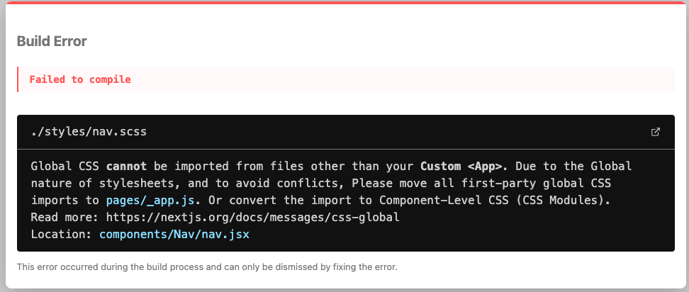

那么我如果想在组件内单独使用样式，就只能使用局部样式了。

### 局部样式

如果我们想在某个组件中使用局部样式，就可以采用常见的module的方案，即给我们的样式文件添加`.module`的中缀。

比如：`nav.module.scss`

我们重新引入该文件，为其添加样式。

```scss
// styles/nav.module.scss
.font-style{
  color: $var;
}
```

```jsx
import { useRouter } from 'next/router';
import React from 'react';
import styles from '../../styles/nav.module.scss';

export default () => {  
  const router = useRouter();
  const goTo = (path) => {
    router.push(`/${path}`);
  }
  return <div className={
      `
      nav
      ${styles['font-style']}
      `
  }>
	.......
  </div>
}
```

可以看到，样式被成功添加，并且通过module添加的样式也多了一串哈希值用于避免冲突

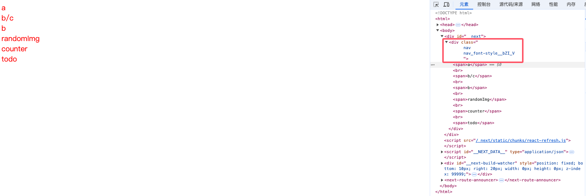

# 五、Next与状态管理（Redux）

## 1.安装必要的库

- 首先需要安装  `react-redux`、`@redux/toolkit`

  。可以使用以下命令进行安装：

  ```plaintext
  npm install react-redux @redux/toolkit
  ```

## 2. 目录结构

在这篇文章中，我们使用一个经典的计数器的例子

- actions目录下主要存放各个actions类型
- reducers目录下存放着各个reducer，最后集中到rootReducer进行导出
- index文件下进行store的创建
- provider文件创建了一个provider组件，用于注入store

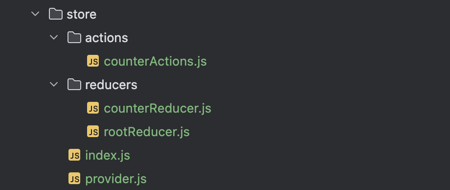

## 3. 创建action

在actions当中，我们通常对一个事件的动作类型进行定义，后续所有的操作都不能超出actions的范围。我们创建的计数器的例子包括三种动作：增加、减少、重置。

```js
// store/actions/counterActions

const counterActionsType = {
    'INCREMENT': 'INCREMENT',
    'DECREMENT': 'DECREMENT',
    'RESET': 'RESET',
}
export default counterActionsType;
```

## 4. 创建reducer

我们首先创建了一个计数器reducer，在reducer当中，我们将具体的指明store的初始值以及每个动作对应的具体操作。

```js
// store/reducers/counterReducer.js
import counterActionsType from "../actions/counterActions";

const initialState = {
    count: 0
};
function counterReducer(state = initialState, action) {
    switch (action.type) {
        case counterActionsType.INCREMENT:
            return {
                count: state.count + 1
            };
        case counterActionsType.DECREMENT:
            return {
                count: state.count - 1
            }
        case counterActionsType.RESET:
            return {
                count: initialState.count
            }
        default:
            return state;
    }
}
export default counterReducer;
```

最后，我们将reducer集合到rootReducer当中，统一导出，方便我们创建store。

```js
// store/reducers/rootReducer.js
import { combineReducers } from'redux';
import counterReducer from './counterReducer';

const rootReducer = combineReducers({
    counterReducer,
});

export default rootReducer;
```

## 5. 创建store

我们通过`configureStore`建立store，并导出。

```js
// store/index.js
import { configureStore } from "@reduxjs/toolkit";
import rootReducer from "./reducers/rootReducer";

export const store = configureStore({
    reducer: {
        rootReducer,
    }
})
```

## 6. 注入store

我们创建了一个`ReduxProvider`组件，这个组件的作用是将我们创建好的store注入到子组件当中

```js
// store/provider

import { store } from "./index";
import { Provider} from "react-redux";
import React from "react";

export function ReduxProvider({children}){
    return <Provider store={store}>{children}</Provider>
}
```

最后我们在_app.js中用`ReduxProvider`包裹，实现store的注入。

```js
// _app.js
import { useRouter } from 'next/router';
import React from 'react';
import {ReduxProvider} from "../store/provider";

const App = (context) => {
    const { Component, pageProps } = context;
    return <ReduxProvider>
        <Component {...pageProps}/>
    </ReduxProvider>
};

export default App;
```

## 7. 使用store

下面我们创建一个counter页面，在这个页面中，我们将引用store，并且对其进行修改。

```js
// pages/counter.js
import React from 'react';
import { useSelector, useDispatch } from 'react-redux';
import counterActionsType from "../store/actions/counterActions";

const CounterPage = () => {
    const count = useSelector((state) => {
        return state.rootReducer.counterReducer.count;
    });
    const dispatch = useDispatch();
    const increment = () => {
        dispatch({ type: counterActionsType.INCREMENT });
    };
    const decrement = () => {
        dispatch({ type: counterActionsType.DECREMENT });
    };
    const reset = () => {
        dispatch({ type: counterActionsType.RESET });
    };
    return (
        <div>
            <p>Count: {count}</p>
            <button onClick={increment}>Increment</button>
            <button onClick={decrement}>decrement</button>
            <button onClick={reset}>reset</button>
        </div>
    );
}

export default CounterPage;
```

## 8.值得注意的点

Next是一个SSR应用，所以redux的初始化也在服务端进行，然后将页面以及store都发送给客户端。之后store将被存储在客户端。

在每次页面重新渲染时，服务端都会重新初始化store发送给客户端。

# 六、Next与API处理

## **Next.js中API路由的基本原理**   

​		在Next.js中，`pages/api`目录下的文件是用于创建API端点的。这些API端点在服务器端运行，并且它们的行为和普通的页面路由有所不同。当请求一个`pages/api`下的文件时，Next.js会将这个请求视为一个API请求，而不是像对`pages`目录下其他页面文件那样进行页面渲染相关的路由处理。 

 	**直接处理请求**：API路由文件实际上是一个独立的服务器端端点。例如，当你在`pages/api/hello.js`中定义了一个API处理函数，Next.js会直接根据请求的URL路径（如`/api/hello`）来调用这个文件中的处理函数来处理请求，而不是经过页面路由系统的匹配和渲染过程。 

​	**绕过页面渲染逻辑**：与页面路由不同，访问`pages/api`下的文件不会触发像`getStaticProps`、`getServerSideProps`这样用于页面数据获取和预渲染的函数，也不会渲染对应的React组件来生成HTML页面。它主要是用于处理数据请求、执行服务器端操作（如数据库查询、文件操作等）并返回数据给客户端，通常返回的数据格式可以是JSON、XML或者其他格式。 

## 实践

在项目中新建`pages/api/getRandomImg.js`，下面这个api通过axios访问了一个随机返回图片的地址，然后将图片地址返回。

```js
import axios from "axios";

export default function handler(req, res) {
    try {
        const imageUrl = 'https://picsum.photos/200';
        axios({
            method: 'get',
            url: imageUrl,
            responseType: 'stream'
        }).then((response) => {
            res.setHeader('Content-Type', 'text/plain');
            console.log(response.data.responseUrl);
            res.send(response.data.responseUrl)
        }).catch((error) => {
            console.error(error);
            res.status(500).end('Internal Server Error');
        });
    } catch (error) {
        console.error(error);
        res.status(500).end('Internal Server Error');
    }
}
```

下面，我们用浏览器访问`localhost:3000/api/getRandomImg`

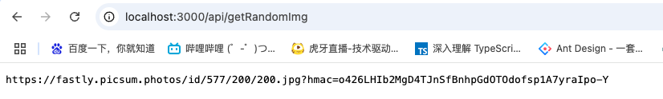

可以看到，接口返回了一张图片的地址。

下面，我们希望在我们的页面中运用这个接口，有两种方法：

- 页面直接调用
- 服务端调用（`getServerSideProps`）


## 页面直接调用

这种方式通过axios在浏览器页面直接调用接口，属于前端中比较常规的做法。

```jsx
// pages/randomImg.js
import React, { useEffect, useState } from 'react';
import axios from "axios";

export default () => {
    const [imgUrl, setImgUrl] = useState('');
    useEffect(() => {
        axios.get('http://localhost:3000/api/getRandomImg').then(
            res => {
                try {
                    setImgUrl(res.data);
                } catch (e) {
                    console.error(e);
                }
            }
        )
    }, []);
    return <>
        I'm randomImg
        <br/>
        
    </>;
};
```

查看页面请求，可以发现，浏览器调用了`getRandomImg`


## 服务端调用

我们都知道，nextJS是SSR应用，页面内容可以在服务端准备好以后，再交由浏览器端渲染。NextJS提供了一个名为`getServerSideProps`的方法，这个方法在服务端执行，然后将数据注入到props当中，页面渲染组件时，可以通过props获得数据。

```jsx
// pages/randomImg.js
import React, { useEffect, useState } from 'react';
import axios from "axios";

export default (props) => {
    const [imgUrl, setImgUrl] = useState('');
    const { data } = props;
    useEffect(() => {
        setImgUrl(data);
    }, [data,]);
    return <>
        I'm randomImg
        <br/>
        
    </>;
};

export async function getServerSideProps(context) {
    const { req, res } = context;
    console.log('req,res',req,res);
    const response = await axios.get('http://localhost:3000/api/getRandomImg');
    const data = response.data;
    console.log(data);
    return {
        props: {
            data
        }
    };
}
```

可以看到，浏览器并没有调用`getRandomImg`，在请求的资源当中可以看到一个名为`randomImg.json`的文件，其中记录了该页面的props。


### 如果页面本身就存在props传递，nextJS会如何处理？

1. `getServerSideProps`的基本功能与`props`传递机制
   - `getServerSideProps`是 Next.js 用于服务器端渲染（SSR）的一个函数。它的主要目的是在每次页面请求时，在服务器端获取数据，并将这些数据作为`props`传递给页面组件。
   - 这个函数返回的`props`会与页面组件本身已有的`props`进行合并，而不是重置。例如，如果页面组件在其他地方（如父组件传递或者组件内部默认设置）已经有了一些`props`，`getServerSideProps`返回的`props`会将新的数据添加进去或者覆盖同名的`props`属性，但不会清除其他非同名的`props`。

2. 示例说明

- 假设页面组件已有`props`的情况

  - 假设有一个`pages/index.js`页面组件，代码如下：

    ```javascript
    function IndexPage({ existingProp, newPropFromServer }) {
      return (
        <div>
          <p>Existing Prop: {existingProp}</p>
          <p>New Prop from Server: {newPropFromServer}</p>
        </div>
      );
    }
    IndexPage.defaultProps = {
      existingProp: 'This is an existing prop'
    };
    export async function getServerSideProps() {
      const newPropFromServer = 'This is a new prop from the server';
      return {
        props: {
          newPropFromServer
        }
      };
    }
    export default IndexPage;
    ```

  - 在这个例子中，`IndexPage`组件有一个默认的`props`（`existingProp`），并且`getServerSideProps`函数返回了一个新的`props`（`newPropFromServer`）。当页面渲染时，这两个`props`都会被传递到组件中，不会因为`getServerSideProps`返回了新的`props`而丢失原有的`props`。

- `props`合并与覆盖的情况

  - 如果`getServerSideProps`返回的`props`中有与组件已有的`props`同名的属性，那么会覆盖原来的属性值。例如，修改上面的代码，让`getServerSideProps`也返回一个`existingProp`

    ```javascript
    function IndexPage({ existingProp, newPropFromServer }) {
      return (
        <div>
          <p>Existing Prop: {existingProp}</p>
          <p>New Prop from Server: {newPropFromServer}</p>
        </div>
      );
    }
    IndexPage.defaultProps = {
      existingProp: 'This is an existing prop'
    };
    export async function getServerSideProps() {
      const newPropFromServer = 'This is a new prop from the server';
      const existingProp = 'This is a new value for existing prop from the server';
      return {
        props: {
          existingProp,
          newPropFromServer
        }
      };
    }
    export default IndexPage;
    ```

  - 此时，在组件中接收到的`existingProp`的值是`getServerSideProps`返回的新值，而不是组件默认的`props`中的值，这体现了同名`props`的覆盖机制。

  ### 宏任务/微任务与getServerSideProps

  **宏任务和`getServerSideProps`的关系**

  - 在`getServerSideProps`中，如`setTimeout`这样的宏任务不会阻塞`getServerSideProps`的执行。这是因为 Node.js（Next.js 服务器端基于 Node.js）的事件循环机制，宏任务会被放入宏任务队列，`getServerSideProps`会继续执行而不会等待宏任务完成。

  - 例如，在`getServerSideProps`函数中有如下代码：

    ```javascript
    export async function getServerSideProps() {
      console.log("开始执行getServerSideProps");
      setTimeout(() => {
        console.log("宏任务中的代码");
      }, 0);
      console.log("继续执行getServerSideProps");
      const data = { message: "示例数据" };
      return {
        props: {
          data
        }
      };
    }
    ```

  - 执行顺序是先打印`开始执行getServerSideProps`，接着把`setTimeout`中的回调函数放入宏任务队列，然后打印`继续执行getServerSideProps`并返回`props`数据。在`getServerSideProps`执行完毕后，事件循环会在合适的时候执行宏任务队列中的代码，打印`宏任务中的代码`。

**微任务和`await`在`getServerSideProps`中的作用**

- 当使用`await`时，实际上是暂停了`getServerSideProps`函数的执行，直到`await`后面的 Promise 被解决（resolved）或被拒绝（rejected）。这和微任务的执行顺序有关，因为`await`会将后续代码放入微任务队列等待 Promise 状态改变后执行。

- 例如，在`getServerSideProps`中有如下代码：

  ```javascript
  export async function getServerSideProps() {
    console.log("开始执行getServerSideProps");
    const response = await axios.get("https://example.com/api/data");
    console.log("Axios请求完成后的打印");
    const data = response.data;
    return {
      props: {
        data
      }
    };
  }
  ```

  - 在这里，`axios.get`返回一个 Promise。当执行到`await`时，`getServerSideProps`会暂停，将后续代码（从`console.log("Axios请求完成后的打印");`开始）放入微任务队列。当`axios`请求完成，Promise 被解决，事件循环会从微任务队列中取出并执行这些后续代码。所以从这个角度看，`await`会 “阻塞”`getServerSideProps`的执行，直到 Promise 相关的微任务完成，这种阻塞是为了确保能正确获取和使用异步操作的结果。

# 七、Next实践（Todo）

下面我们将实现一个`Todo`的例子，实践一下基于next和mysql的一般开发流程。

## 1.功能设计

这个Demo的功能比较简单，包括两个页面，一个Todo列表以及具体的任务清单。

点击具体的Todo项以后就会跳转到对应的Task列表，在Task列表可以进行任务状态的修改以及任务的删除。

Todo列表：


Task列表：


## 2.数据库设计

数据库名为`nextDemo`，其中有两个表：`tableList`,`taskList`分别用于存储todo列表和具体的任务列表信息。

`taskList`通过`table_id`的外键与`tableList`关联。

下面是两个表的字段信息以及一部分数据。可以用项目中的`nextDemo.sql`生成该数据库。

`tableList`:

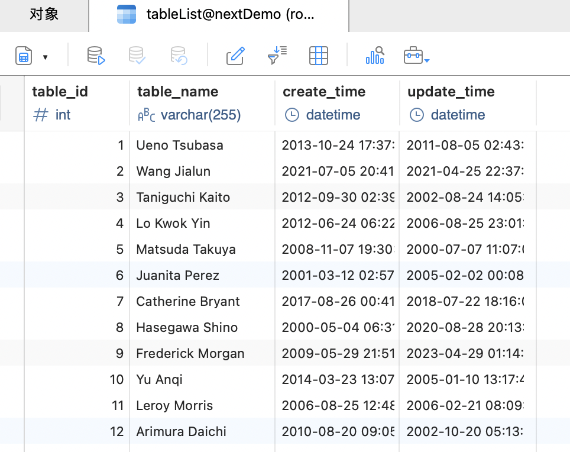

`taskList`:

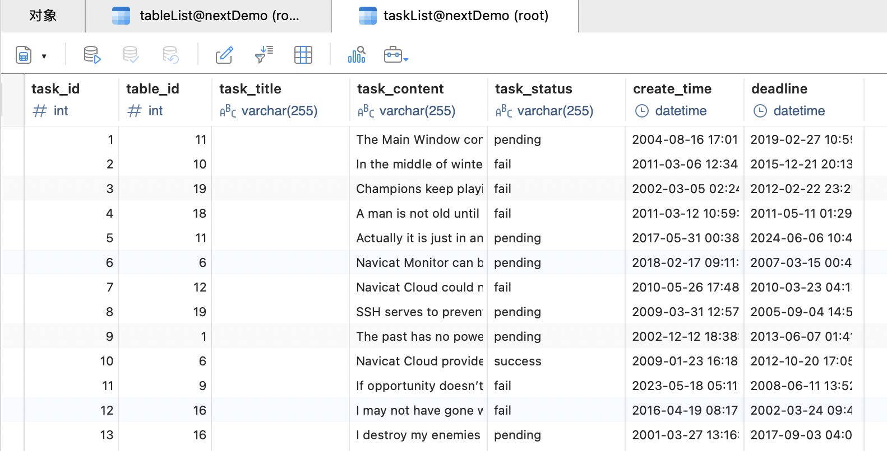

## 3.查询接口开发

### 配置数据库连接：

在`lib/db.js`下，配置node和js的连接文件。

```js
// lib/db.js
import mysql from 'mysql2/promise';

const pool = mysql.createPool({
    host: 'your host', // 本地开发一般直接用localhost
    user: 'your username', // 一般是root
    password: 'your password',
    database: 'nextDemo',
    waitForConnections: true,
    connectionLimit: 10,
    queueLimit: 0
});

export default pool;
```

### 接口开发：

在next中，在`pages/api/apiName`下开发的api会被自动视为api端口。比如`pages/api/todo/getTableList.js`，通过`http://localhost:3000/api/todo/getTableList`进行调用。

在这个`Demo`中开发了四个接口，分别用于查询tableList，查询、删、更新taskList。

查询tableList接口比较简单，直接把整个表都查过来了，没有做分页（感兴趣的朋友可以自己进行优化）。所以就没有参数。

```js
// pages/api/todo/getTableList.js
import pool from '../../../lib/db';

export default async function handler(req, res) {
    try {
        const connection = await pool.getConnection();
        const [rows, fields] = await connection.execute('SELECT * FROM tableList');
        connection.release();
        res.status(200).json(rows);
    } catch (error) {
        console.error(error);
        res.status(500).json({ error: 'Internal Server Error' });
    }
}
```

`getTaskList`就需要查询是哪个`table_id`的任务，所以需要传参数，这里我通过query的方式，把参数放在url当中进行传递。比如：`http://localhost:3000/task?table_id=1`，这个例子就传递了`table_id=1`的参数。

在api中可以通过`req.query`进行获取。

更新与删除操作也都类似。

```js
// pages/api/todo/getTaskList.js
import pool from '../../../lib/db';

export default async function handler(req, res) {
    try {
        const connection = await pool.getConnection();
        const [rows, fields] = await connection.execute(`SELECT * FROM taskList where table_id=${req.query.table_id}`);
        connection.release();
        res.status(200).json(rows);
    } catch (error) {
        console.error(error);
        res.status(500).json({ error: 'Internal Server Error' });
    }
}
```

```js
// pages/api/todo/updateTask.js
import pool from '../../../lib/db';

export default async function handler(req, res) {
    try {
        const connection = await pool.getConnection();
        const { task_id, task_status } = req.query;
        const [rows, fields] = await connection.execute(`
            UPDATE taskList
            SET task_status = '${task_status}'
            where task_id = ${task_id}
        `);
        connection.release();
        res.status(200).json(rows);
    } catch (error) {
        console.error(error);
        res.status(500).json({ error: 'Internal Server Error' });
    }
}
```

```js
// pages/api/todo/delTask.js
import pool from '../../../lib/db';

export default async function handler(req, res) {
    try {
        const connection = await pool.getConnection();
        console.log('req.query.task_id', req.query.task_id);
        const [rows, fields] = await connection.execute(`DELETE FROM taskList where task_id=${req.query.task_id}`);
        connection.release();
        res.status(200).json(rows);
    } catch (error) {
        console.error(error);
        res.status(500).json({ error: 'Internal Server Error' });
    }
}
```

## 4.页面开发

在该`demo`中，我们一共要开发两个页面分别是展示任务清单的`Todo`页面，以及具体的任务页面`Task`。

在`todo`页面，我们通过`getServerSideProps`在服务端调用`getTableList`的api，在获取数据以后，以props的形式传递给页面。最后在服务端生成页面以后直接发送给浏览器进行渲染。

下面是具体的页面代码、样式代码以及具体的页面展示。

```jsx
// pages/todo.js
import React, {useState} from "react";
import axios from "axios";
import {useRouter} from "next/router";
import moment from "moment";
import styles from '../styles/todo.module.scss'

const todo = (props) => {
    const [tableList, setTableList] = useState(props.data);
    const router = useRouter();
    return <div className={styles.container}>
        <h1>Todo</h1>
        {tableList.map(item => {
            return <li key={item.table_id} onClick={() => { router.push(`/task?table_id=${item.table_id}`); }}>
                <span>标题：{item.table_name}</span>
                <span>创建时间：{moment(item.create_time).format('YYYY-MM-DD HH:mm:ss')}</span>
            </li>
        })}
    </div>
}

export default todo;

export async function getServerSideProps(context) {
    const { req, res } = context;
    console.log('req,res',req,res);
    // 微任务用await关键字可以阻塞getServerSideProps的执行
    const response = await axios.get('http://localhost:3000/api/todo/getTableList');
    const data = response.data;
    console.log(data);
    return {
        props: {
            data
        }
    };
}
```

```scss
// styles/todo.module.scss
.container {
  display: inline-block;
  width: 500px;
  li{
    display: flex;
    justify-content: space-between;
    cursor: pointer;
    line-height: 30px;
    border: 1px solid black;
    padding: 0 4px;
  }
}
```


在`task`页面，最初的数据获取我们通过`getServerSideProps`进行数据获取，但是在后续的数据更新、查询以及删除都是在浏览器端进行的，并且用`useState`进行实时的页面更新。

```jsx
// pages/task.js
import React, {useState} from "react";
import axios from "axios";
import styles from "../styles/task.module.scss";
import moment from "moment";
import {useRouter} from "next/router";

const task = (props) => {
    const [taskList, setTaskList] = useState(props.data);
    const router = useRouter();
    const  getTaskList = async () => {
        const response = await axios.get(`http://localhost:3000/api/todo/getTaskList?table_id=${router?.query?.table_id}`);
        setTaskList(response.data);
    }
    const deleteTask = async (task_id) => {
        const response = await axios.delete(`http://localhost:3000/api/todo/delTask?task_id=${task_id}`);
        getTaskList();
    }
    const updateTask = async (task_id, task_status) => {
        const response = await axios.delete(`http://localhost:3000/api/todo/updateTask?task_id=${task_id}&&task_status=${task_status}`);
        console.log(response);
        getTaskList();
    }
    return <div className={styles.container}>
        <h1>Task</h1>
        {taskList.map(task => {
            return <div key={task.task_id} className={styles.item}>
                    <span className={styles.id}>id:{task.task_id}</span>
                    <span className={styles.content}>内容：{task.task_content}</span>
                    <span className={styles.deadline}>截止时间：{moment(task.deadline).format('YYYY年MM月DD日')}</span>
                    <select
                        value={task.task_status}
                        onChange={(e) => {
                            console.log('e',e.target.value);
                            updateTask(task.task_id, e.target.value);
                        }}
                    >
                        <option value="pending">进行中</option>
                        <option value="success">成功</option>
                        <option value="fail">失败</option>
                    </select>
                    <button onClick={() => {
                        deleteTask(task.task_id);
                    }}>删除</button>
            </div>
        })}
    </div>
}

export default task;

export async function getServerSideProps(context) {
    const { req, res, query } = context;
    const response = await axios.get(`http://localhost:3000/api/todo/getTaskList?table_id=${query?.table_id}`);
    const data = response.data;
    return {
        props: {
            data
        },
    };
}
```

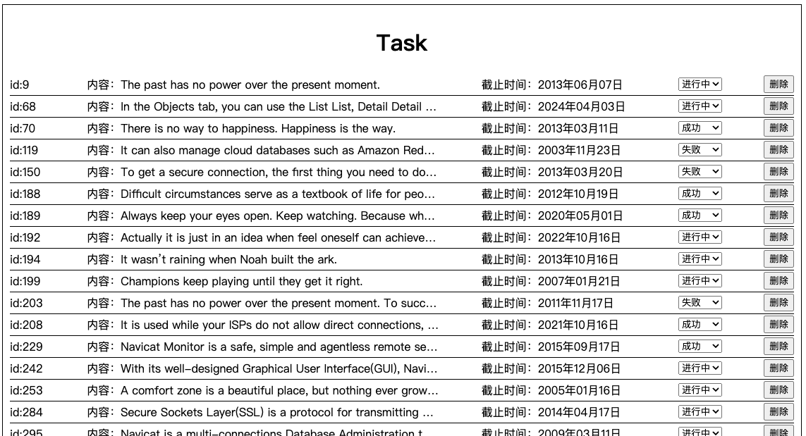