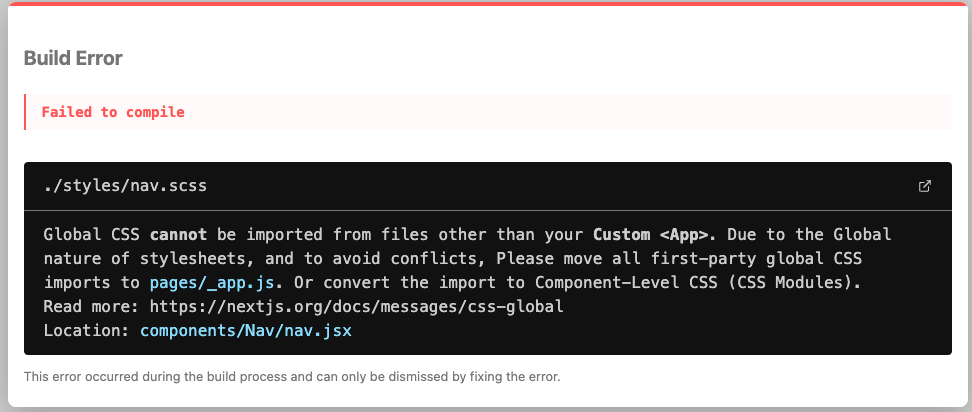
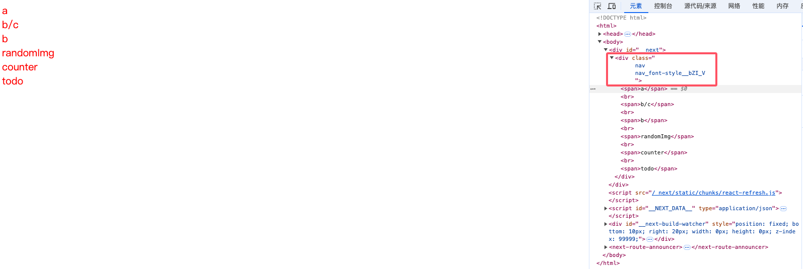

# Next的样式处理

next当中使用样式基本与普通的react没什么区别，这里我们结合使用next和scss。next项目内置支持sass，所以只需要安装好依赖就可以直接使用，

## 1.安装依赖

- 首先需要安装`sass`这个依赖。如果你的项目是使用 npm，可以运行以下命令：

```plaintext
npm install sass
```

- 如果是使用 yarn，可以使用以下命令：

```plaintext
yarn add sass
```

## 2.配置 Next.js

- 在项目的根目录下创建一个`next.config.js`文件（如果不存在的话）。在这个文件中配置 Next.js 来识别和处理`scss`文件。

```javascript
const nextConfig = {
    sassOptions: {
        additionalData: `$var: red;`,
    },
}

export default nextConfig
```

- 这个配置定义了一个名为`$var`的sass变量，值为red，后续编写样式的时候可以直接使用。

```scss
// 在某个.scss 文件中
.class {
  color: $var;
}
```

## 3.在组件中使用 Scss

有两种样式使用方式：

- 全局样式：全局范围内都会生效，会存在样式名冲突
- 局部样式：给每个样式都打上一串哈希值，从而实现每个样式名都不一样，避免样式名冲突

### 全局样式

这里我们用全局样式给nav组件添加一个鼠标悬浮变成小手的样式。创建一个`styles/global.scsss`用来编写全局样式。

```scss
// styles/global.scss
.nav{
  font-size: 20px;
  cursor: pointer;
}
```

在`_app.js`中导入样式

```jsx
// _app.js
import React from 'react';
import {ReduxProvider} from "../store/provider";
import "../styles/global.scss";

const App = (context) => {
    const { Component, pageProps } = context;
    return <ReduxProvider>
        <Component {...pageProps} />
    </ReduxProvider>
};

export default App;
```

这样我们在nav中使用`.nav`就可以引入样式啦。

```jsx
import { useRouter } from 'next/router';
import React from 'react';  

export default () => {  
  const router = useRouter();
  const goTo = (path) => {
    router.push(`/${path}`);
  }
  return <div className='nav'>
 	......
  </div>
}
```

值得注意的是，next中为了约束全局样式的样式，避免样式冲突，规定了全局样式只能在`_app.js`中进行导入。如果有别的地方尝试导入全局样式，那么就会直接报错。

比如我现在尝试在nav组件中直接引入`nav.scss`，就会出现如下报错。



那么我如果想在组件内单独使用样式，就只能使用局部样式了。

### 局部样式

如果我们想在某个组件中使用局部样式，就可以采用常见的module的方案，即给我们的样式文件添加`.module`的中缀。

比如：`nav.module.scss`

我们重新引入该文件，为其添加样式。

```scss
// styles/nav.module.scss
.font-style{
  color: $var;
}
```

```jsx
import { useRouter } from 'next/router';
import React from 'react';
import styles from '../../styles/nav.module.scss';

export default () => {  
  const router = useRouter();
  const goTo = (path) => {
    router.push(`/${path}`);
  }
  return <div className={
      `
      nav
      ${styles['font-style']}
      `
  }>
	.......
  </div>
}
```

可以看到，样式被成功添加，并且通过module添加的样式也多了一串哈希值用于避免冲突

