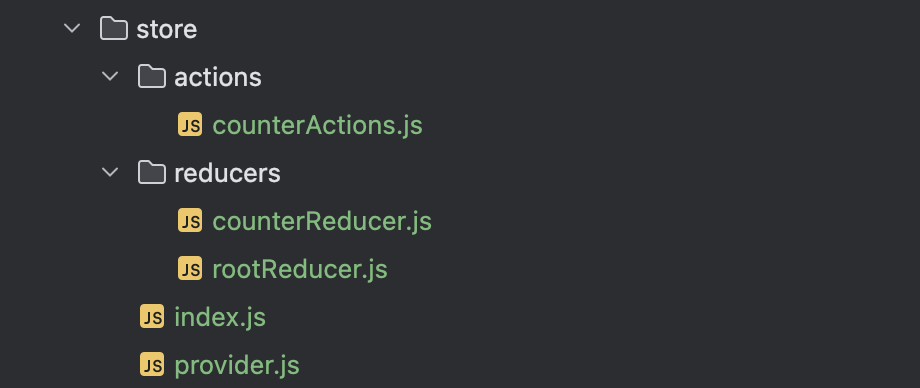

## 1.安装必要的库

- 首先需要安装  `react-redux`、`@redux/toolkit`

  。可以使用以下命令进行安装：

  ```plaintext
  npm install react-redux @redux/toolkit
  ```

## 2. 目录结构

在这篇文章中，我们使用一个经典的计数器的例子

- actions目录下主要存放各个actions类型
- reducers目录下存放着各个reducer，最后集中到rootReducer进行导出
- index文件下进行store的创建
- provider文件创建了一个provider组件，用于注入store



## 3. 创建action

在actions当中，我们通常对一个事件的动作类型进行定义，后续所有的操作都不能超出actions的范围。我们创建的计数器的例子包括三种动作：增加、减少、重置。

```js
// store/actions/counterActions

const counterActionsType = {
    'INCREMENT': 'INCREMENT',
    'DECREMENT': 'DECREMENT',
    'RESET': 'RESET',
}
export default counterActionsType;
```

## 4. 创建reducer

我们首先创建了一个计数器reducer，在reducer当中，我们将具体的指明store的初始值以及每个动作对应的具体操作。

```js
// store/reducers/counterReducer.js
import counterActionsType from "../actions/counterActions";

const initialState = {
    count: 0
};
function counterReducer(state = initialState, action) {
    switch (action.type) {
        case counterActionsType.INCREMENT:
            return {
                count: state.count + 1
            };
        case counterActionsType.DECREMENT:
            return {
                count: state.count - 1
            }
        case counterActionsType.RESET:
            return {
                count: initialState.count
            }
        default:
            return state;
    }
}
export default counterReducer;
```

最后，我们将reducer集合到rootReducer当中，统一导出，方便我们创建store。

```js
// store/reducers/rootReducer.js
import { combineReducers } from'redux';
import counterReducer from './counterReducer';

const rootReducer = combineReducers({
    counterReducer,
});

export default rootReducer;
```

## 5. 创建store

我们通过`configureStore`建立store，并导出。

```js
// store/index.js
import { configureStore } from "@reduxjs/toolkit";
import rootReducer from "./reducers/rootReducer";

export const store = configureStore({
    reducer: {
        rootReducer,
    }
})
```

## 6. 注入store

我们创建了一个`ReduxProvider`组件，这个组件的作用是将我们创建好的store注入到子组件当中

```js
// store/provider

import { store } from "./index";
import { Provider} from "react-redux";
import React from "react";

export function ReduxProvider({children}){
    return <Provider store={store}>{children}</Provider>
}
```

最后我们在_app.js中用`ReduxProvider`包裹，实现store的注入。

```js
// _app.js
import { useRouter } from 'next/router';
import React from 'react';
import {ReduxProvider} from "../store/provider";

const App = (context) => {
    const { Component, pageProps } = context;
    return <ReduxProvider>
        <Component {...pageProps}/>
    </ReduxProvider>
};

export default App;
```

## 7. 使用store

下面我们创建一个counter页面，在这个页面中，我们将引用store，并且对其进行修改。

```js
// pages/counter.js
import React from 'react';
import { useSelector, useDispatch } from 'react-redux';
import counterActionsType from "../store/actions/counterActions";

const CounterPage = () => {
    const count = useSelector((state) => {
        return state.rootReducer.counterReducer.count;
    });
    const dispatch = useDispatch();
    const increment = () => {
        dispatch({ type: counterActionsType.INCREMENT });
    };
    const decrement = () => {
        dispatch({ type: counterActionsType.DECREMENT });
    };
    const reset = () => {
        dispatch({ type: counterActionsType.RESET });
    };
    return (
        <div>
            <p>Count: {count}</p>
            <button onClick={increment}>Increment</button>
            <button onClick={decrement}>decrement</button>
            <button onClick={reset}>reset</button>
        </div>
    );
}

export default CounterPage;
```

## 8.值得注意的点

Next是一个SSR应用，所以redux的初始化也在服务端进行，然后将页面以及store都发送给客户端。之后store将被存储在客户端。

在每次页面重新渲染时，服务端都会重新初始化store发送给客户端。