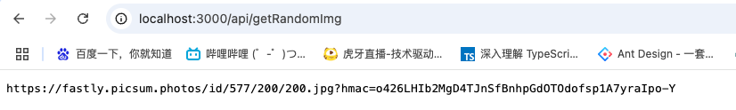

## **Next.js中API路由的基本原理**   

​		在Next.js中，`pages/api`目录下的文件是用于创建API端点的。这些API端点在服务器端运行，并且它们的行为和普通的页面路由有所不同。当请求一个`pages/api`下的文件时，Next.js会将这个请求视为一个API请求，而不是像对`pages`目录下其他页面文件那样进行页面渲染相关的路由处理。 

 	**直接处理请求**：API路由文件实际上是一个独立的服务器端端点。例如，当你在`pages/api/hello.js`中定义了一个API处理函数，Next.js会直接根据请求的URL路径（如`/api/hello`）来调用这个文件中的处理函数来处理请求，而不是经过页面路由系统的匹配和渲染过程。 

​	**绕过页面渲染逻辑**：与页面路由不同，访问`pages/api`下的文件不会触发像`getStaticProps`、`getServerSideProps`这样用于页面数据获取和预渲染的函数，也不会渲染对应的React组件来生成HTML页面。它主要是用于处理数据请求、执行服务器端操作（如数据库查询、文件操作等）并返回数据给客户端，通常返回的数据格式可以是JSON、XML或者其他格式。 

## 实践

在项目中新建`pages/api/getRandomImg.js`，下面这个api通过axios访问了一个随机返回图片的地址，然后将图片地址返回。

```js
import axios from "axios";

export default function handler(req, res) {
    try {
        const imageUrl = 'https://picsum.photos/200';
        axios({
            method: 'get',
            url: imageUrl,
            responseType: 'stream'
        }).then((response) => {
            res.setHeader('Content-Type', 'text/plain');
            console.log(response.data.responseUrl);
            res.send(response.data.responseUrl)
        }).catch((error) => {
            console.error(error);
            res.status(500).end('Internal Server Error');
        });
    } catch (error) {
        console.error(error);
        res.status(500).end('Internal Server Error');
    }
}
```

下面，我们用浏览器访问`localhost:3000/api/getRandomImg`



可以看到，接口返回了一张图片的地址。

下面，我们希望在我们的页面中运用这个接口，有两种方法：

- 页面直接调用
- 服务端调用（`getServerSideProps`）


## 页面直接调用

这种方式通过axios在浏览器页面直接调用接口，属于前端中比较常规的做法。

```jsx
// pages/randomImg.js
import React, { useEffect, useState } from 'react';
import axios from "axios";

export default () => {
    const [imgUrl, setImgUrl] = useState('');
    useEffect(() => {
        axios.get('http://localhost:3000/api/getRandomImg').then(
            res => {
                try {
                    setImgUrl(res.data);
                } catch (e) {
                    console.error(e);
                }
            }
        )
    }, []);
    return <>
        I'm randomImg
        <br/>
        
    </>;
};
```

查看页面请求，可以发现，浏览器调用了`getRandomImg`


## 服务端调用

我们都知道，nextJS是SSR应用，页面内容可以在服务端准备好以后，再交由浏览器端渲染。NextJS提供了一个名为`getServerSideProps`的方法，这个方法在服务端执行，然后将数据注入到props当中，页面渲染组件时，可以通过props获得数据。

```jsx
// pages/randomImg.js
import React, { useEffect, useState } from 'react';
import axios from "axios";

export default (props) => {
    const [imgUrl, setImgUrl] = useState('');
    const { data } = props;
    useEffect(() => {
        setImgUrl(data);
    }, [data,]);
    return <>
        I'm randomImg
        <br/>
        
    </>;
};

export async function getServerSideProps(context) {
    const { req, res } = context;
    console.log('req,res',req,res);
    const response = await axios.get('http://localhost:3000/api/getRandomImg');
    const data = response.data;
    console.log(data);
    return {
        props: {
            data
        }
    };
}
```

可以看到，浏览器并没有调用`getRandomImg`，在请求的资源当中可以看到一个名为`randomImg.json`的文件，其中记录了该页面的props。


### 如果页面本身就存在props传递，nextJS会如何处理？

1. `getServerSideProps`的基本功能与`props`传递机制
   - `getServerSideProps`是 Next.js 用于服务器端渲染（SSR）的一个函数。它的主要目的是在每次页面请求时，在服务器端获取数据，并将这些数据作为`props`传递给页面组件。
   - 这个函数返回的`props`会与页面组件本身已有的`props`进行合并，而不是重置。例如，如果页面组件在其他地方（如父组件传递或者组件内部默认设置）已经有了一些`props`，`getServerSideProps`返回的`props`会将新的数据添加进去或者覆盖同名的`props`属性，但不会清除其他非同名的`props`。

2. 示例说明

- 假设页面组件已有`props`的情况

  - 假设有一个`pages/index.js`页面组件，代码如下：

    ```javascript
    function IndexPage({ existingProp, newPropFromServer }) {
      return (
        <div>
          <p>Existing Prop: {existingProp}</p>
          <p>New Prop from Server: {newPropFromServer}</p>
        </div>
      );
    }
    IndexPage.defaultProps = {
      existingProp: 'This is an existing prop'
    };
    export async function getServerSideProps() {
      const newPropFromServer = 'This is a new prop from the server';
      return {
        props: {
          newPropFromServer
        }
      };
    }
    export default IndexPage;
    ```

  - 在这个例子中，`IndexPage`组件有一个默认的`props`（`existingProp`），并且`getServerSideProps`函数返回了一个新的`props`（`newPropFromServer`）。当页面渲染时，这两个`props`都会被传递到组件中，不会因为`getServerSideProps`返回了新的`props`而丢失原有的`props`。

- `props`合并与覆盖的情况

  - 如果`getServerSideProps`返回的`props`中有与组件已有的`props`同名的属性，那么会覆盖原来的属性值。例如，修改上面的代码，让`getServerSideProps`也返回一个`existingProp`

    ```javascript
    function IndexPage({ existingProp, newPropFromServer }) {
      return (
        <div>
          <p>Existing Prop: {existingProp}</p>
          <p>New Prop from Server: {newPropFromServer}</p>
        </div>
      );
    }
    IndexPage.defaultProps = {
      existingProp: 'This is an existing prop'
    };
    export async function getServerSideProps() {
      const newPropFromServer = 'This is a new prop from the server';
      const existingProp = 'This is a new value for existing prop from the server';
      return {
        props: {
          existingProp,
          newPropFromServer
        }
      };
    }
    export default IndexPage;
    ```

  - 此时，在组件中接收到的`existingProp`的值是`getServerSideProps`返回的新值，而不是组件默认的`props`中的值，这体现了同名`props`的覆盖机制。

  ### 宏任务/微任务与getServerSideProps

  **宏任务和`getServerSideProps`的关系**

  - 在`getServerSideProps`中，如`setTimeout`这样的宏任务不会阻塞`getServerSideProps`的执行。这是因为 Node.js（Next.js 服务器端基于 Node.js）的事件循环机制，宏任务会被放入宏任务队列，`getServerSideProps`会继续执行而不会等待宏任务完成。

  - 例如，在`getServerSideProps`函数中有如下代码：

    ```javascript
    export async function getServerSideProps() {
      console.log("开始执行getServerSideProps");
      setTimeout(() => {
        console.log("宏任务中的代码");
      }, 0);
      console.log("继续执行getServerSideProps");
      const data = { message: "示例数据" };
      return {
        props: {
          data
        }
      };
    }
    ```

  - 执行顺序是先打印`开始执行getServerSideProps`，接着把`setTimeout`中的回调函数放入宏任务队列，然后打印`继续执行getServerSideProps`并返回`props`数据。在`getServerSideProps`执行完毕后，事件循环会在合适的时候执行宏任务队列中的代码，打印`宏任务中的代码`。

**微任务和`await`在`getServerSideProps`中的作用**

- 当使用`await`时，实际上是暂停了`getServerSideProps`函数的执行，直到`await`后面的 Promise 被解决（resolved）或被拒绝（rejected）。这和微任务的执行顺序有关，因为`await`会将后续代码放入微任务队列等待 Promise 状态改变后执行。

- 例如，在`getServerSideProps`中有如下代码：

  ```javascript
  export async function getServerSideProps() {
    console.log("开始执行getServerSideProps");
    const response = await axios.get("https://example.com/api/data");
    console.log("Axios请求完成后的打印");
    const data = response.data;
    return {
      props: {
        data
      }
    };
  }
  ```

  - 在这里，`axios.get`返回一个 Promise。当执行到`await`时，`getServerSideProps`会暂停，将后续代码（从`console.log("Axios请求完成后的打印");`开始）放入微任务队列。当`axios`请求完成，Promise 被解决，事件循环会从微任务队列中取出并执行这些后续代码。所以从这个角度看，`await`会 “阻塞”`getServerSideProps`的执行，直到 Promise 相关的微任务完成，这种阻塞是为了确保能正确获取和使用异步操作的结果。