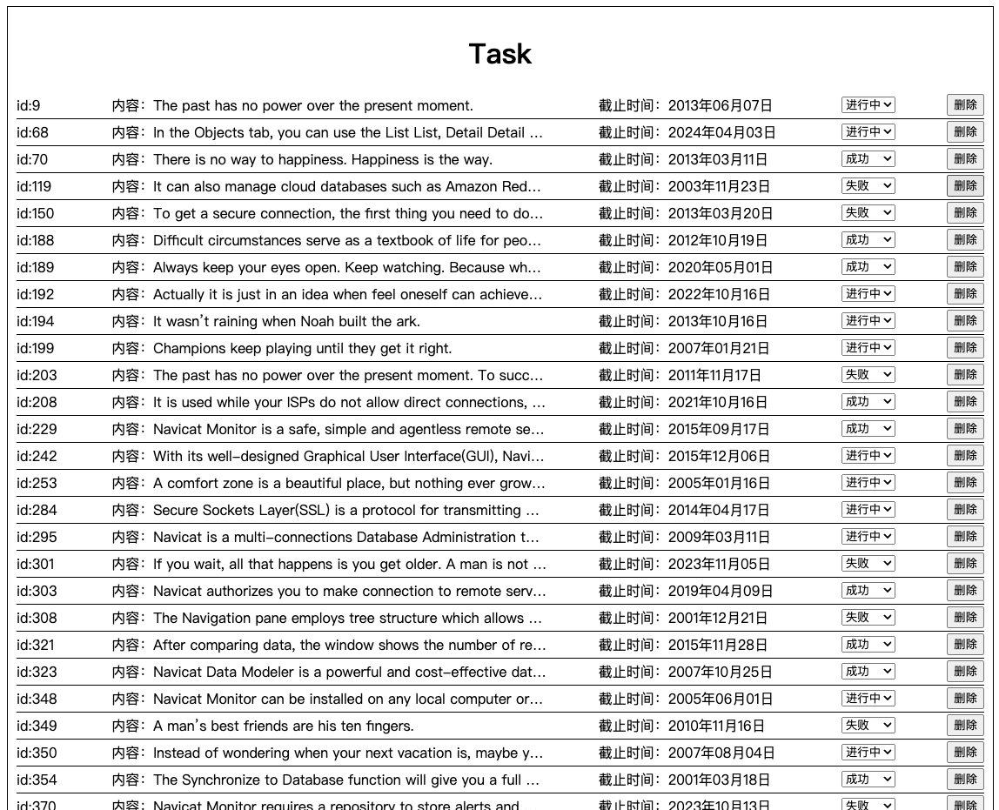
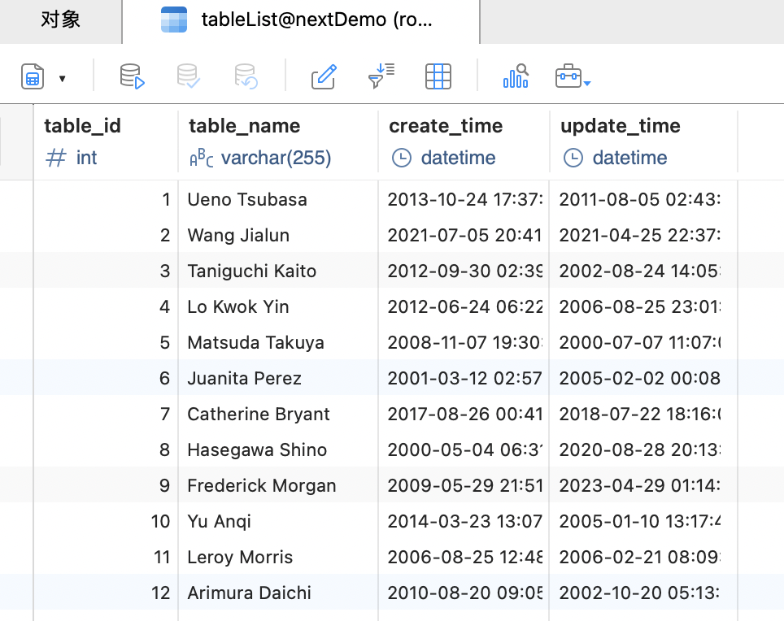
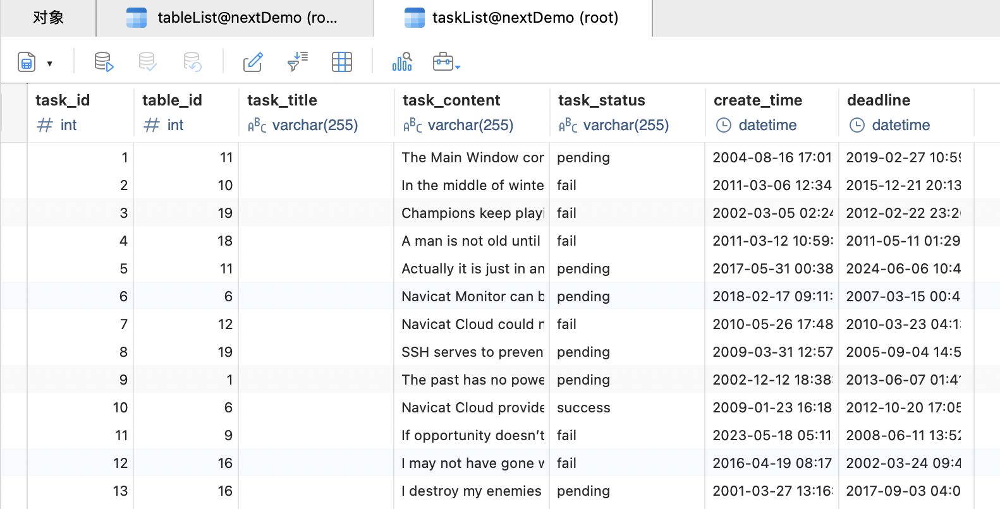
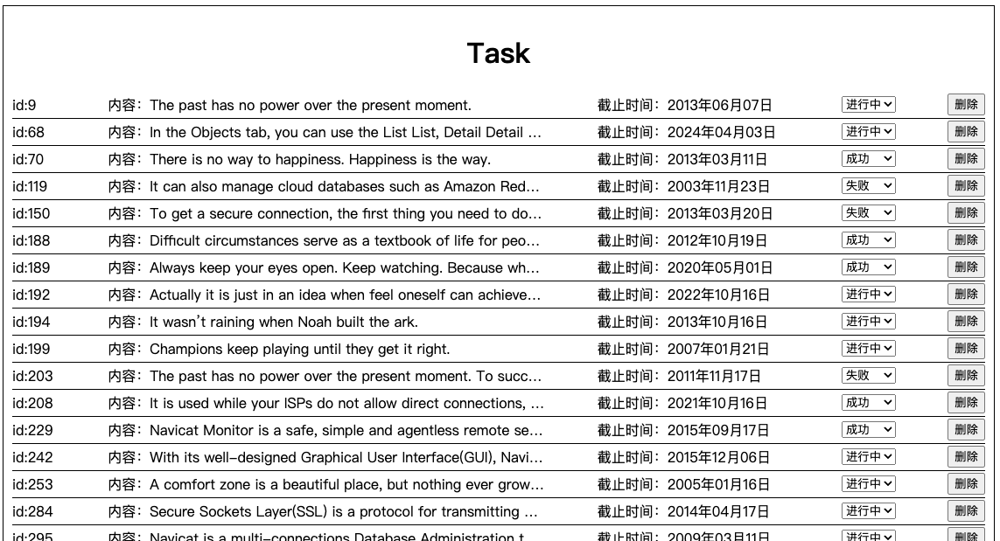

我们通过一个todo的例子来讲解如何结合使用nextjs和mysql

## 1.功能设计

这个Demo的功能比较简单，包括两个页面，一个Todo列表以及具体的任务清单。

点击具体的Todo项以后就会跳转到对应的Task列表，在Task列表可以进行任务状态的修改以及任务的删除。

Todo列表：


Task列表：



## 2.数据库设计

数据库名为`nextDemo`，其中有两个表：`tableList`,`taskList`分别用于存储todo列表和具体的任务列表信息。

`taskList`通过`table_id`的外键与`tableList`关联。

下面是两个表的字段信息以及一部分数据。可以用项目中的`nextDemo.sql`生成该数据库。

`tableList`:



`taskList`:



## 3.查询接口开发

### 配置数据库连接：

在`lib/db.js`下，配置node和js的连接文件。

```js
// lib/db.js
import mysql from 'mysql2/promise';

const pool = mysql.createPool({
    host: 'your host', // 本地开发一般直接用localhost
    user: 'your username', // 一般是root
    password: 'your password',
    database: 'nextDemo',
    waitForConnections: true,
    connectionLimit: 10,
    queueLimit: 0
});

export default pool;
```

### 接口开发：

在next中，在`pages/api/apiName`下开发的api会被自动视为api端口。比如`pages/api/todo/getTableList.js`，通过`http://localhost:3000/api/todo/getTableList`进行调用。

在这个`Demo`中开发了四个接口，分别用于查询tableList，查询、删、更新taskList。

查询tableList接口比较简单，直接把整个表都查过来了，没有做分页（感兴趣的朋友可以自己进行优化）。所以就没有参数。

```js
// pages/api/todo/getTableList.js
import pool from '../../../lib/db';

export default async function handler(req, res) {
    try {
        const connection = await pool.getConnection();
        const [rows, fields] = await connection.execute('SELECT * FROM tableList');
        connection.release();
        res.status(200).json(rows);
    } catch (error) {
        console.error(error);
        res.status(500).json({ error: 'Internal Server Error' });
    }
}
```

`getTaskList`就需要查询是哪个`table_id`的任务，所以需要传参数，这里我通过query的方式，把参数放在url当中进行传递。比如：`http://localhost:3000/task?table_id=1`，这个例子就传递了`table_id=1`的参数。

在api中可以通过`req.query`进行获取。

更新与删除操作也都类似。

```js
// pages/api/todo/getTaskList.js
import pool from '../../../lib/db';

export default async function handler(req, res) {
    try {
        const connection = await pool.getConnection();
        const [rows, fields] = await connection.execute(`SELECT * FROM taskList where table_id=${req.query.table_id}`);
        connection.release();
        res.status(200).json(rows);
    } catch (error) {
        console.error(error);
        res.status(500).json({ error: 'Internal Server Error' });
    }
}
```

```js
// pages/api/todo/updateTask.js
import pool from '../../../lib/db';

export default async function handler(req, res) {
    try {
        const connection = await pool.getConnection();
        const { task_id, task_status } = req.query;
        const [rows, fields] = await connection.execute(`
            UPDATE taskList
            SET task_status = '${task_status}'
            where task_id = ${task_id}
        `);
        connection.release();
        res.status(200).json(rows);
    } catch (error) {
        console.error(error);
        res.status(500).json({ error: 'Internal Server Error' });
    }
}
```

```js
// pages/api/todo/delTask.js
import pool from '../../../lib/db';

export default async function handler(req, res) {
    try {
        const connection = await pool.getConnection();
        console.log('req.query.task_id', req.query.task_id);
        const [rows, fields] = await connection.execute(`DELETE FROM taskList where task_id=${req.query.task_id}`);
        connection.release();
        res.status(200).json(rows);
    } catch (error) {
        console.error(error);
        res.status(500).json({ error: 'Internal Server Error' });
    }
}
```

## 4.页面开发

在该`demo`中，我们一共要开发两个页面分别是展示任务清单的`Todo`页面，以及具体的任务页面`Task`。

在`todo`页面，我们通过`getServerSideProps`在服务端调用`getTableList`的api，在获取数据以后，以props的形式传递给页面。最后在服务端生成页面以后直接发送给浏览器进行渲染。

下面是具体的页面代码、样式代码以及具体的页面展示。

```jsx
// pages/todo.js
import React, {useState} from "react";
import axios from "axios";
import {useRouter} from "next/router";
import moment from "moment";
import styles from '../styles/todo.module.scss'

const todo = (props) => {
    const [tableList, setTableList] = useState(props.data);
    const router = useRouter();
    return <div className={styles.container}>
        <h1>Todo</h1>
        {tableList.map(item => {
            return <li key={item.table_id} onClick={() => { router.push(`/task?table_id=${item.table_id}`); }}>
                <span>标题：{item.table_name}</span>
                <span>创建时间：{moment(item.create_time).format('YYYY-MM-DD HH:mm:ss')}</span>
            </li>
        })}
    </div>
}

export default todo;

export async function getServerSideProps(context) {
    const { req, res } = context;
    console.log('req,res',req,res);
    // 微任务用await关键字可以阻塞getServerSideProps的执行
    const response = await axios.get('http://localhost:3000/api/todo/getTableList');
    const data = response.data;
    console.log(data);
    return {
        props: {
            data
        }
    };
}
```

```scss
// styles/todo.module.scss
.container {
  display: inline-block;
  width: 500px;
  li{
    display: flex;
    justify-content: space-between;
    cursor: pointer;
    line-height: 30px;
    border: 1px solid black;
    padding: 0 4px;
  }
}
```


在`task`页面，最初的数据获取我们通过`getServerSideProps`进行数据获取，但是在后续的数据更新、查询以及删除都是在浏览器端进行的，并且用`useState`进行实时的页面更新。

```jsx
// pages/task.js
import React, {useState} from "react";
import axios from "axios";
import styles from "../styles/task.module.scss";
import moment from "moment";
import {useRouter} from "next/router";

const task = (props) => {
    const [taskList, setTaskList] = useState(props.data);
    const router = useRouter();
    const  getTaskList = async () => {
        const response = await axios.get(`http://localhost:3000/api/todo/getTaskList?table_id=${router?.query?.table_id}`);
        setTaskList(response.data);
    }
    const deleteTask = async (task_id) => {
        const response = await axios.delete(`http://localhost:3000/api/todo/delTask?task_id=${task_id}`);
        getTaskList();
    }
    const updateTask = async (task_id, task_status) => {
        const response = await axios.delete(`http://localhost:3000/api/todo/updateTask?task_id=${task_id}&&task_status=${task_status}`);
        console.log(response);
        getTaskList();
    }
    return <div className={styles.container}>
        <h1>Task</h1>
        {taskList.map(task => {
            return <div key={task.task_id} className={styles.item}>
                    <span className={styles.id}>id:{task.task_id}</span>
                    <span className={styles.content}>内容：{task.task_content}</span>
                    <span className={styles.deadline}>截止时间：{moment(task.deadline).format('YYYY年MM月DD日')}</span>
                    <select
                        value={task.task_status}
                        onChange={(e) => {
                            console.log('e',e.target.value);
                            updateTask(task.task_id, e.target.value);
                        }}
                    >
                        <option value="pending">进行中</option>
                        <option value="success">成功</option>
                        <option value="fail">失败</option>
                    </select>
                    <button onClick={() => {
                        deleteTask(task.task_id);
                    }}>删除</button>
            </div>
        })}
    </div>
}

export default task;

export async function getServerSideProps(context) {
    const { req, res, query } = context;
    const response = await axios.get(`http://localhost:3000/api/todo/getTaskList?table_id=${query?.table_id}`);
    const data = response.data;
    return {
        props: {
            data
        },
    };
}
```

